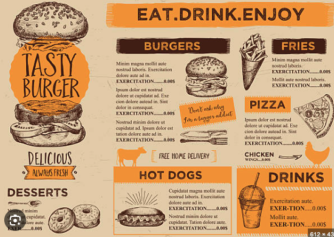
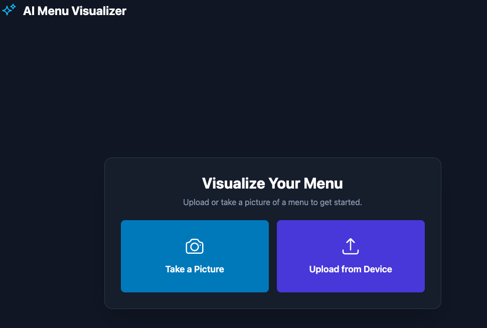
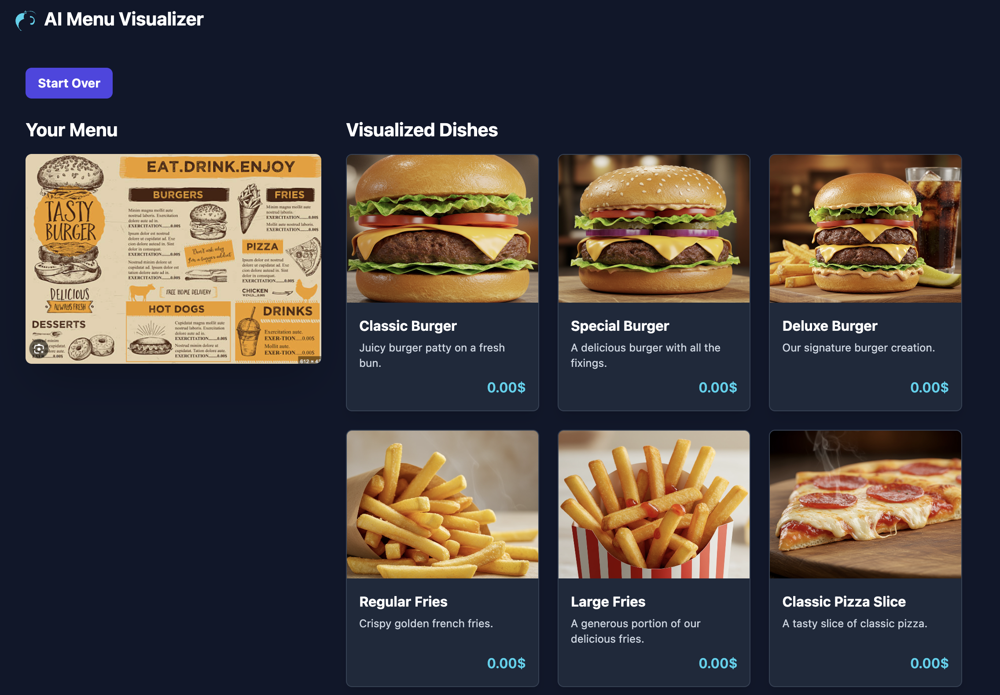

# Run and deploy your AI Studio app

This contains everything you need to run your app locally.

## Run Locally

**Prerequisites:**  Node.js

1. Install dependencies:
   `npm install`
2. Set the `GEMINI_API_KEY` in [.env.local](.env.local) to your Gemini API key
   > **Important Note**: The Imagen API (used for generating food images) is currently only accessible to Google Cloud users with billing enabled. You'll need a paid Google Cloud account to use the image generation feature. The menu text analysis feature works with a standard API key.
3. Run the app:
   `npm run dev`

---

# AI Menu Visualizer: Bringing Restaurant Menus to Life

*This post is my submission for [DEV Education Track: Build Apps with Google AI Studio](https://dev.to/deved/build-apps-with-google-ai-studio).*

## What I Built
I created an AI Menu Visualizer that transforms static restaurant menus into vibrant visual experiences. Using Google's Gemini AI, the app can analyze both English and Chinese menu text, identify dish names, and generate photorealistic images for each dish. The key prompts include menu text extraction with structured JSON output and carefully crafted image generation prompts for appetizing, professional food photography.

## Demo

Try it out: [Your deployed URL]

Key Features:
- Bilingual menu support (English & Chinese)
- Real-time dish detection and image generation
- Modern, responsive UI with Tailwind CSS
- Progress tracking for multi-dish menus
- Error handling and graceful fallbacks

## My Experience
Building with Google AI Studio and Gemini was surprisingly intuitive. Key takeaways:

1. **Multimodal Power**: Gemini's ability to understand both text and images made menu analysis seamless. The model handles bilingual content exceptionally well.

2. **Structured Output**: Using the `responseMimeType: "application/json"` config ensures clean, parseable responses - crucial for production applications.

3. **Image Generation Quality**: Gemini's Imagen model produces consistently high-quality food photography, though prompting requires careful crafting for best results.

4. **Developer Experience**: The `@google/genai` SDK is well-documented and TypeScript-friendly, making integration straightforward.

The most challenging aspect was optimizing the image generation prompts to produce consistent, appetizing results across diverse cuisine types. The solution was to standardize the prompt structure with specific photography-focused language.

This project demonstrates how AI can enhance real-world dining experiences by bridging the gap between text menus and visual presentation.

